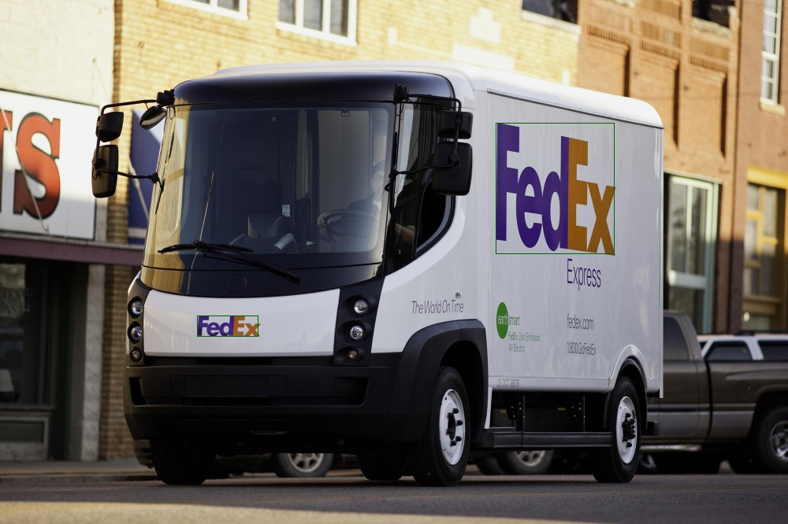
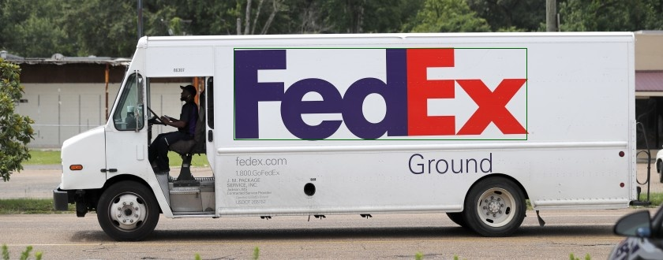
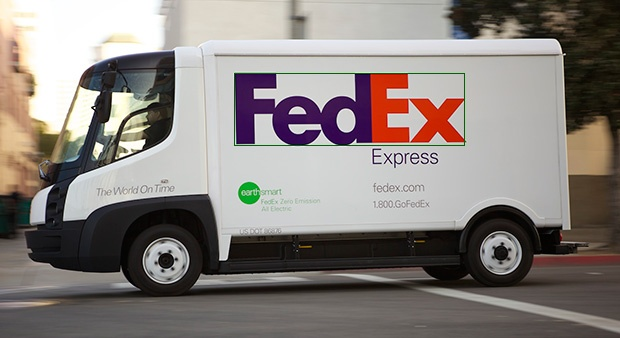

# image-recognition

Application which detects FedEx logo in images.

## Preview
| | | 
:-------------------------:|:-------------------------:
  |  
 | 


## Getting Started

These instructions will get you a copy of the project up and running on your local machine for development and testing purposes. See deployment for notes on how to deploy the project on a live system.

### Clone
Clone this repo to your local machine:
```
git clone git@github.com:wwrzesien/imageRecognition.git
```

### Prerequisites
- Python (https://www.python.org/downloads/)
- Virtual environment
```
pip install virtualenv
```

### Setup
Create a virtual environment:
```
virtualenv fedex_recognition
```
Activate an environment:
```
source  fedex_recognition/bin/activate
```

In `imageRecognition` run:
```
pip install -r requirements.txt
```

### Deployment
Activate an environment:
```
source  fedex_recognition/bin/activate
```
In `imageRecognition` run estimation:
```
python program.py
```

## Built With
- [OpenCV](https://docs.opencv.org/master/d6/d00/tutorial_py_root.html) - is a library of programming functions mainly aimed at real-time computer vision.

## Author
- **Wojciech Wrzesień** - [wwrzesien](https://github.com/wwrzesien)
